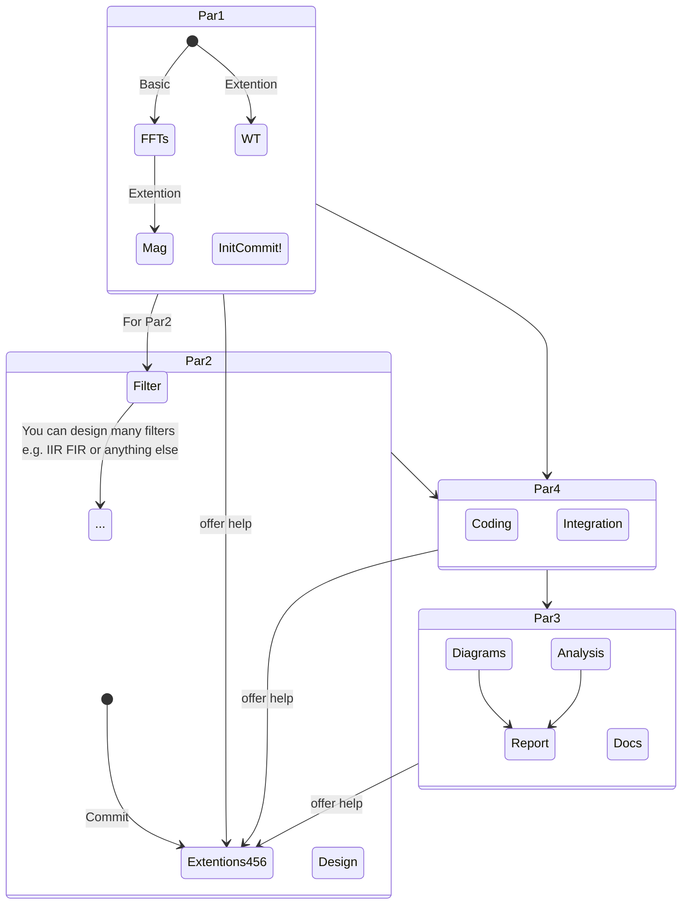

# WorkFlow of the cource design

## Work to be done

### Tips

> Par1 for these algorithms

> Par2 for these designs and should be responsible for the Extentions

> Par3(Flexible) for docs, Better with Latex or anything else you like
>
> > For Par3: If you also want to do tasks above (Par1 Par2) You can participate in.Just discuss with Par4 to share your doc work to be done with Par4.

> Par4 refers to all these works and do coding for the implements for algorithms and designs
